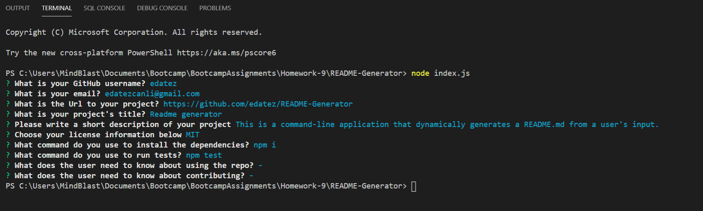
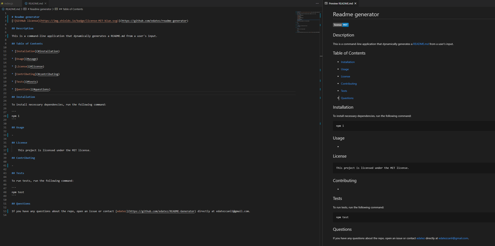

# Readme Generator

This is a command-line application that dynamically generates a README.md from a user's input. 

## Usage
The application will be invoked with the following command:

```sh
cd develop
node index.js
```

## Steps
The user will be prompted for their GitHub username and other information pertaining to the project the README is for.

### Screenshot 1 - Usage
Here is a screenshot that shows the list of questions the user will be asked:




### Screenshot 2 - Result

The README generator then creates a README.md file similar to the screenshot below:



### File - Readme.md

The example shown above can be accessed in this repository at the following path:
```sh
./develop/README.md
```